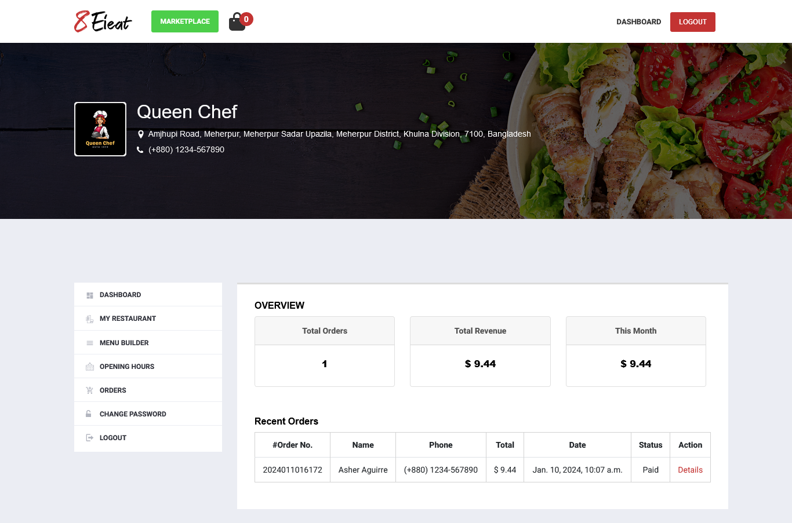

# Eieat Marketplace

An online food marketplace where customers can order foods and restaurants can join and publish their menu on the marketplace.

| Previews                                                                                     |
| -------------------------------------------------------------------------------------------- |
| *Homepage*<br/>                        |
| *Admin panel*<br/> |
| *Restaurant's dashboard*<br/>          |
| *Customer's dashboard*<br/>            |

---

## Requirements

- Python 3.11 or higher

- PostgreSQL

- smtp4dev

- Git Bash (Optional)

---

## Installation

Open `cmd` or `bash` in the project directory.

**Install Python virtual environment**

```bash
pip install virtualenv
```

**Create a virtual environment**

```bash
virtualenv env_name
```

**Activate virtual environment**

On `Mac` and `Linux` (Also if you are using `bash` on `Windows`)

```bash
source env_name/bin/activate
```

On `Windows` (If you are using `cmd`)

```bash
.\env_name\Scripts\activate
```

**Install dependencies**

```bash
pip install -r requirements.txt
```

---

## Environment Variables

To run this project, you will need to create and add the following environment variables to your `.env` file

`DEBUG=True`

To generate a new secret key

```bash
python manage.py shell -c "from django.core.management.utils import get_random_secret_key; print(get_random_secret_key())"
```

`SECRET_KEY=django-insecure-YOUR_SECRET_KEY`

**You need to create a new `PostgreSQL` database**

`DB_NAME=YOUR_DATABASE_NAME`

`DB_USER=DATABASE_USER`

`DB_PASSWORD=YOUR_DATABASE_PASSWORD`

`DB_HOST=localhost`

**You need to create `stripe` developer account**

`STRIPE_PUBLISHABLE_KEY=STRIPE_PUBLISHABLE_KEY`

`STRIPE_SECRET_KEY=STRIPE_SECRET_KEY`

`BACKEND_DOMAIN=http://127.0.0.1:8000`

---

## Run Locally

**Migrate database**

```bash
python manage.py makemigrations && python manage.py migrate
```

**Create an admin user**

```bash
python manage.py createsuperuser
```

**Run the `Django` server**

```bash
python manage.py runserver
```

**Run the `smtp4dev` server to prevent any potential errors while creating restaurant and customer accounts or carrying out food ordering processes.**

***Or***

**Configure `smtp` in the `settings.py` to use your own email server.**

```python
EMAIL_BACKEND = 'django.core.mail.backends.smtp.EmailBackend'
EMAIL_HOST = 'smtp.your-email-provider.com'
EMAIL_PORT = 587
EMAIL_USE_TLS = True
EMAIL_HOST_USER = 'your-email@example.com'
EMAIL_HOST_PASSWORD = 'your-email-App-password'
```

You can access the website at http://127.0.0.1:8000/ and the admin panel at http://127.0.0.1:8000/admin

---

## License

[MIT](https://choosealicense.com/licenses/mit/)
